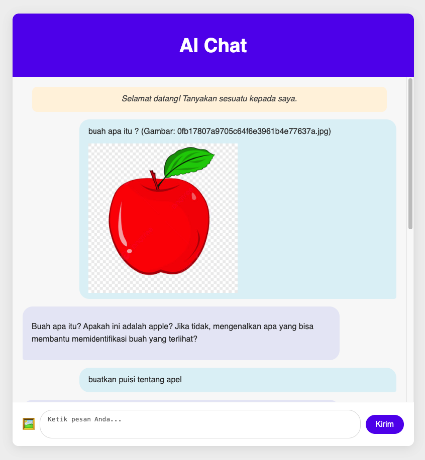

# AI Chatbot Lokal dengan FastAPI & Ollama

Proyek ini adalah *chatbot* AI sederhana yang berjalan di perangkat Anda, menggunakan **Ollama** untuk model AI, **FastAPI** sebagai *backend* API, dan *frontend* web dasar. Aplikasi ini mendukung input teks dan gambar.




---

## Fitur

* **FastAPI Backend**: API untuk memproses permintaan *chatbot*.
* **Ollama**: Menjalankan model AI lokal (mendukung model *multi-modal* seperti **LLaVA** untuk gambar).
* **Frontend Sederhana**: UI web (`HTML`/`CSS`/`JS`) dengan *styling* ala Gemini.
* **Markdown & Kode**: Respons AI ditampilkan dengan *Markdown* dan *syntax highlighting* untuk blok kode.
* **Unggah Gambar**: Kirim gambar bersama teks ke AI.

---

## Struktur Proyek

```
fastapi_ollama_ai/
├── docker-compose.yml              # Konfigurasi Docker Compose
├── Dockerfile.app                  # Dockerfile untuk FastAPI
├── Dockerfile.frontend             # Dockerfile untuk Frontend (Nginx)
├── Dockerfile.ollama               # Dockerfile untuk Ollama server
├── ollama_entrypoint.sh            # Script startup Ollama
├── nginx.conf                      # Konfigurasi Nginx
├── app/
│   ├── main.py                     # Kode FastAPI
│   ├── requirements.txt            # Dependencies Python
├── frontend/
│   ├── index.html                  # UI utama
│   └── static/
│       ├── style.css               # Styling
│       └── script.js               # Logika frontend
└── README.md                       # File ini
```

---

## Prasyarat

* **Docker Desktop** (Windows/macOS) atau **Docker Engine** (Linux)
* **Docker Compose**
* **GPU (Opsional)**: Sangat direkomendasikan untuk performa AI yang lebih cepat. Pastikan driver dan konfigurasi Docker untuk GPU sudah terinstal.

---

## Cara Menjalankan Aplikasi (Direkomendasikan: Docker Compose)

1.  **Kloning Repositori:**
    ```bash
    git clone https://github.com/sonyamin58/fastapi_ollama_ai.git

    cd fastapi_ollama_ai
    ```

2.  **Konfigurasi Model AI:**
    Buka `docker-compose.yml`. Pastikan `OLLAMA_MODEL_NAME` di layanan `ollama-server` dan `api-app` diatur ke **`llava:7b`** (atau model multi-modal lainnya [disini](https://ollama.com/search). Ini penting untuk fitur gambar. Ollama akan mengunduh model ini saat pertama kali dijalankan.

3.  **Bangun & Jalankan:**
    ```bash
    docker compose up --build -d
    ```
    * `--build`: Membangun ulang *image*. Gunakan setiap kali Anda mengubah kode atau `Dockerfile`.
    * `-d`: Menjalankan di latar belakang.

4.  **Akses Aplikasi:**
    * **Chatbot UI:** Buka *browser* Anda ke `http://localhost:8000`.
    * **FastAPI Docs:** Lihat dokumentasi API di `http://localhost:8001/docs`.


